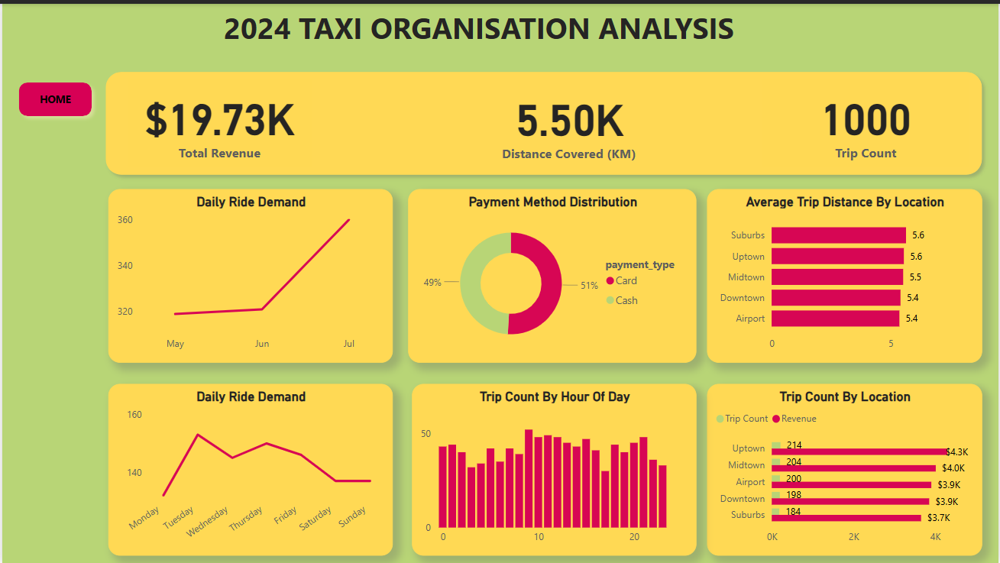
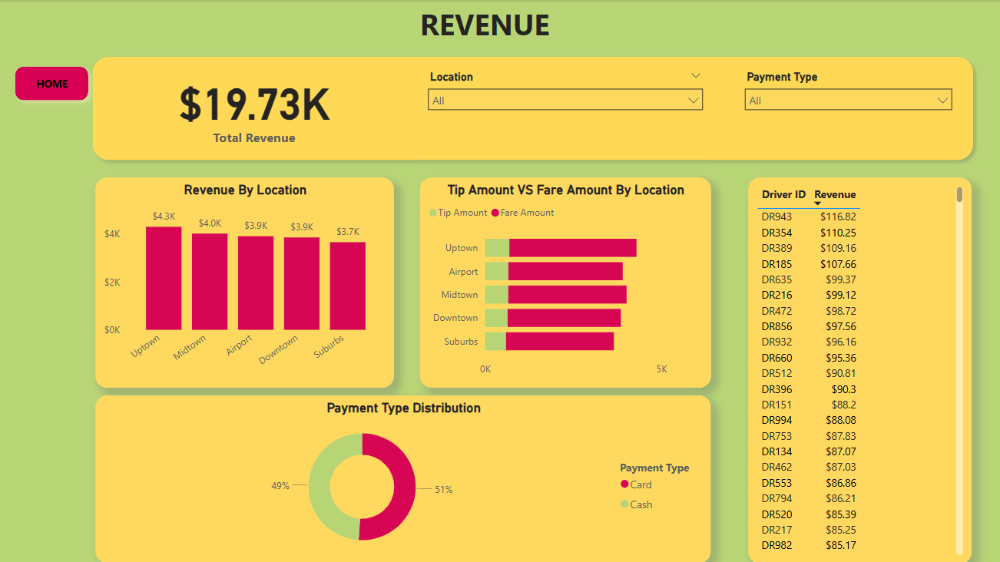
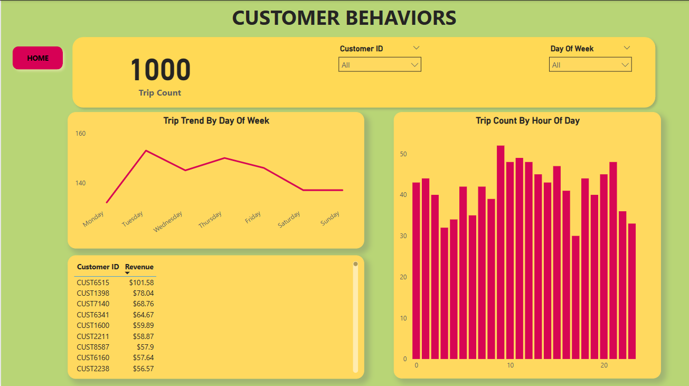
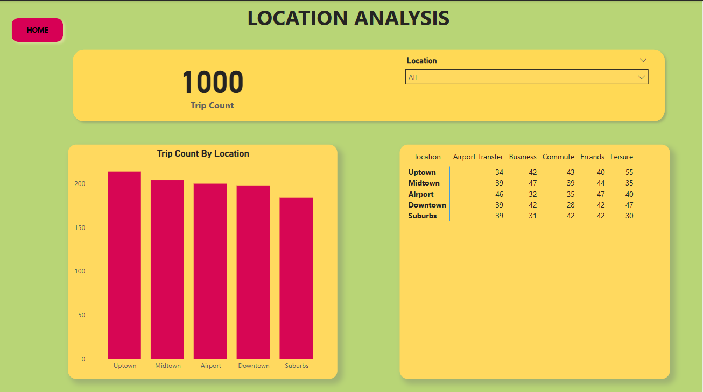
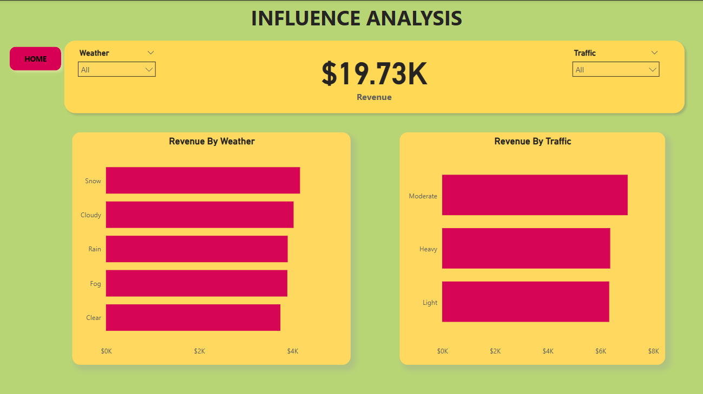

# 2024 TAXI ORGANIZATION ANALYSIS

## Introduction
This project demonstrates my data visualization and reporting expertise through an in-depth analysis of a taxi organization's dataset usin Power BI. The objective is to uncover insights that drive revenue growth and to develop comprehensive, data-driven reports to support strategic decision-making.

## Problem Statement
The taxi organization lacks clear visibility into key operational and financial metrics, which hinders its ability to make data-driven decisions that could improve revenue and efficiency. This project aims to analyze the organization’s dataset to identify patterns, trends, and areas of opportunity, enabling the development of insightful visualizations and actionable reports to support strategic planning and revenue optimization.

## Skills/Concepts Demonstrated
The following Power BI features were incorporated:
- DAX
- Quick mearsures
- Page navigation
- Filters
- Buttons

## Visualization
The report comprises of six(6) pages:
1. Home
2. Overview
3. Revenue
4. Customer Behavior
5. Location
6. Influences

## Home

The homepage features a visually engaging image of a taxi, effectively setting the thematic tone for the project. Positioned on the left side of the interface are clearly labeled navigation buttons — _Overview, Revenue, Customer, Location, and Influences_ — allowing user to seamlessly explore different sections of the report.

## Overview

The Overview page of the dashboard presents a high-level summary of the taxi organization’s key performance indicators (KPIs) and operational insights. It is designed to give stakeholders a quick snapshot of performance metrics in a visually engaging and easy-to-digest format.

Key features of this page include:

Top Metrics Panel:

Total Revenue ($19.73K): Displays cumulative revenue generated over the selected period.

Distance Covered (5.50K KM): Shows the total kilometers covered by all taxis.

Trip Count (1000): Indicates the total number of trips completed.

Visual Insights:

Daily Ride Demand (Monthly & Weekly Trends): Line charts depict ride demand patterns across months and weekdays, helping identify peak periods.

Payment Method Distribution: A donut chart breaks down the percentage of payments made via card versus cash, providing insight into customer preferences.

Average Trip Distance by Location: A horizontal bar chart showing average trip distances across key locations (e.g., Suburbs, Uptown, Downtown), useful for route and pricing optimization.

Trip Count by Hour of Day: A bar chart illustrates ride frequency across different hours, aiding in understanding daily traffic peaks and optimizing driver allocation.

Trip Count by Location (with Revenue Overlay): Combines trip frequency and corresponding revenue per location, highlighting the most profitable and busiest zones.

Navigation Button:

A clearly visible “Home” button at the top left allows users to easily return to the main landing page for seamless navigation.

## Revenue

The Revenue page offers a more granular analysis of the taxi organization’s earnings. This section is essential for stakeholders who want to understand where revenue is being generated, how different payment methods impact income, and which drivers or locations are contributing the most to financial performance.

## Customer Behavior

Overall this page highlights usage patterns across days and hours, and identifies top revenue-generating customers

The location page provides a detailed breakdown of trip activity by geographical areas. The visuals reveals which areas have the most transportation activity and how trip purposes vary by location. this is valuable for targeted service planning or marketing.

This page highlights how external factors like weather and traffic impact revenue. Both weather and traffic conditions have a noticeable but not extreme influence on revenue. The business seems to perform steadily across various conditions, with a slight edge during moderate traffic and adverse weather 

You can interact with the report [here]
